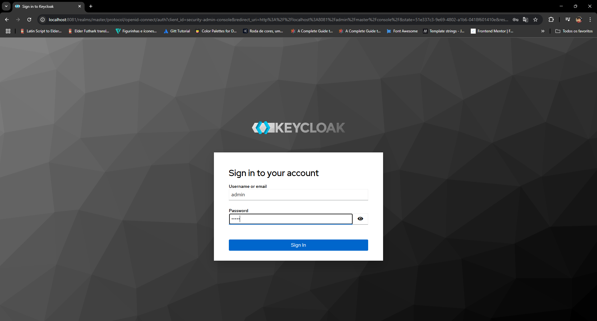
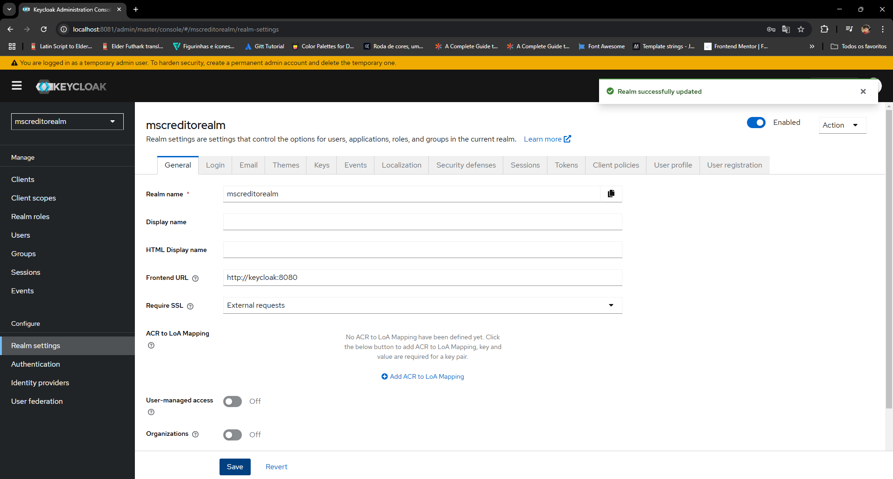

# 💳 Avaliador de crédito 💳

<div align="center">
 <h2> Sumário</h2>
  <a href="#descrição-do-projeto">Descrição do projeto</a> -
  <a href="#ferramentas-utilizadas">Ferramentas utilizadas</a> - 
  <a href="#guia-de-implantação">Guia de implantação</a> -
  <a href="#vídeo-de-demonstração">Vídeo de demonstração</a> -
  <a href="#desenvolvedores">Desenvolvedores</a>
</div>

## Descrição do projeto

<p align="justify">
Este projeto foi criado no intuito de estudar mais sobre a arquitetura de microsserviços e a comunicação síncrona e assíncrona de microsserviços.
</p>

## Funcionalidades
### ms-clientes:
- `Funcionalidade 1:` Salvar cliente.
- `Funcionalidade 2:` Obter dados do cliente por CPF.

### ms-cartoes:
- `Funcionalidade 1:` Cadastrar Cartão.
- `Funcionalidade 2:` Listar cartões por renda.
- `Funcionalidade 3:` Listar cartões por CPF.

 ### ms-avaliador-de-credito:
- `Funcionalidade 1:` Consultar situação do cliente.
- `Funcionalidade 2:` Realizar avaliação do cliente.
- `Funcionalidade 3:` Solicitar cartão.

## Ferramentas utilizadas
<div style="display: flex; gap: 15px">
  <a href="https://www.java.com" target="_blank"> 
       
  </a>
  
  <a href="https://spring.io/" target="_blank"> 
       
  </a>
  
  <a href="https://www.docker.com/" target="_blank">
      
  </a>

  
</div>

- Eureka atuando como Discovery Server.
- KeyCloak para fazer a autenticação e autorização entre microsserviços.
- Spring Cloud Gateway

## Arquitetura
A imagem a seguir representa a arquitetura de microsserviço da aplicação:


## Guia de implantação
Antes de iniciar o projeto, precisamos do [Docker](https://www.docker.com/) e [Git](https://git-scm.com/) instalados em nossas máquinas.
Tendo o git instlado, rode o seguinte comando no terminal da sua máquina:
``` bash
git clone https://github.com/LucasFrancoBN/avaliador-de-credito.git
```
Após isso, rode o seguinte comando no diretório raiz do projeto (somente se tiver o docker instalado em sua máquina): 
``` bash
docker-compose up
```
Depois da inicialização de todos os containers, acesse o painel de controle do Keycloak em http://localhost:8081:

*Digite o usuário como admin e senha admin.*

Agora importe o arquivo json que tem na raiz do projeto (http://localhost:8081/admin/master/console/#/master/add-realm):


Ao acessar o realm que foi criado após a importação do arquivo json, vá em **Realm Settings** > **Frontend URL** e cole a seguinte URL: http://keycloak:8080:


PS: Para facilitar os testes, a Collection do Postman está disponível para testar os endpoints.

## Desenvolvedores
<table align="center">
  <tr>
    <td align="center">
      <div>
        <br>
          <b> Lucas Franco   </b><br>
            <a href="https://www.linkedin.com/in/lucas-franco-barbosa-navarro-a51937221/" alt="Linkedin"></a>
            <a href="https://github.com/LucasFrancoBN" alt="Github"></a>
      </div>
    </td>
  </tr>
</table>
